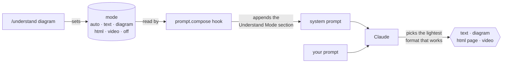

# claude-mods

Claude Code mods (function-hook plugins) by [elharchaoui](https://github.com/elharchaoui).

## Install

```
/plugin marketplace add elharchaoui/claude-mods
/plugin install understand-mode@elharchaoui-mods
```

Requires a Claude Code build with function-hook mods (`hooks/register.ts`). Built and tested on Claude Code 2.1.289.

## understand-mode

Your main job with an agent is oversight: reading what it produces. This mod makes Claude pick the output format that is fastest for you to understand and verify.

<p align="center">
  
</p>

### How it works



The mod adds one section to the system prompt on every turn. That section tells Claude to choose between four formats, alone or combined:

| Format | Used for |
| --- | --- |
| Text, STE style (ASD-STE100, about 80%) | Status updates, summaries, decisions, short answers |
| Diagram | Architecture, data flow, state machines, before/after |
| Throwaway HTML page | Diffs, data explorers, filterable comparisons, walkthroughs |
| Explainer video (Manim style) | Math, algorithms, processes over time; only when asked or high value |

Claude also states its choice in one line ("Format: diagram + text"), leads with the answer, and ends with the one thing you should check next.

In the terminal, diagrams are drawn as box-drawing text, because the terminal does not render Mermaid. Mermaid, SVG and Excalidraw are used only inside HTML pages.

### Command

```
/understand                show the current mode
/understand auto           Claude chooses the format (default)
/understand text           force text
/understand diagram        force diagrams
/understand html           force HTML pages
/understand video          force explainer videos
/understand off            remove the policy from the system prompt
```

The mode applies from the next prompt. It resets to `auto` when the session restarts.

### Develop

```
claude plugin validate plugins/understand-mode
claude plugin test plugins/understand-mode
```

## License

MIT
